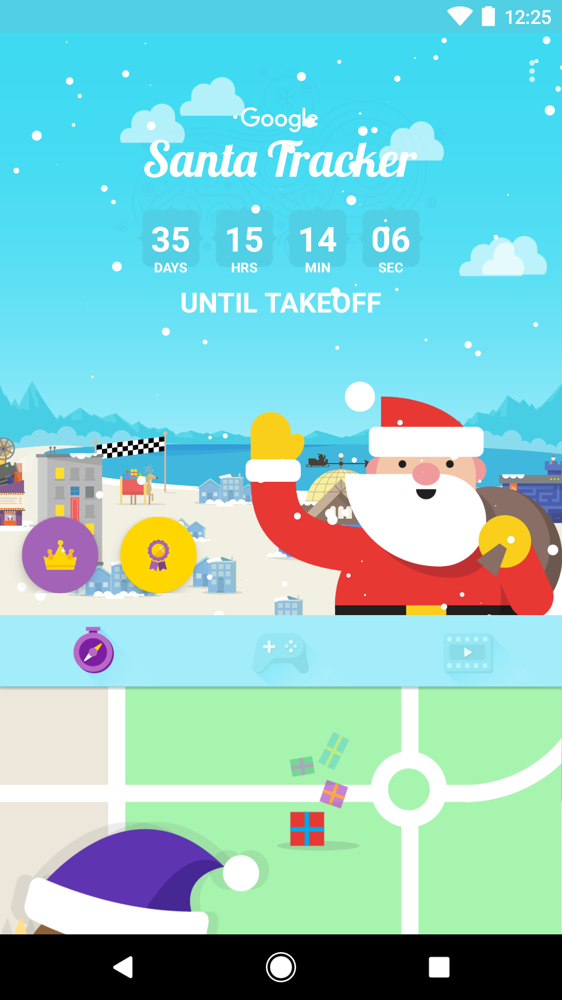

Google Santa Tracker for Android
================================

## About

This repo is a fork of the [Google Santa Tracker app for Android](https://github.com/google/santa-tracker-android).  This fork was created to demonstrate some of the tips and tricks on how to speed up your Android Gradle builds.

## What are the build tips?
1. Use latest Android Gradle plugin
2. Avoid legacy multidex
3. Disable multi-APK
4. Include minimal resources
5. Disable png crunching
6. Use Instant Run
7. Avoid inadvertent changes
8. Don’t use dynamic versions
9. Watch the memory
10. Enable Gradle caching

More details coming...
## How to use this repo
Check out this repo and switch to the agp-2.2.0 branch. This branch contains the pre-optimized build configurations. See [Getting the first build working section](#firstbuild).

Best way to observe the build performance in this branch is to use the [Gradle profiler] (https://github.com/gradle/gradle-profiler). You should familiarize yourself with the Gradle profiler before proceeding. Their repo contains excellent documentation.

Once you have observed the build performance of this branch in various scenarios (see `performance.scenarios`), you can switch to agp-3.0.0 branch to observe the optimized build performance by running the same set of build scenarios in `performance.scenarios` file. You can search throughout the project for "Tip" to find the build config tip to achieve the build time improvements.

## Getting the first build working

First up, Santa Tracker is powered by [Firebase][firebase], so you'll need to enable it
on your Google account over at the [Firebase console][fire-console]. Once you're in the
console, follow these steps:

 * Create a new project
 * Add Firebase to your Android app
  * Package name: `com.google.android.apps.santatracker.debug`
  * Debug signing certificate can be blank, or follow the instructions in the
    tooltip to find yours.
 * Save the `google-services.json` file to the `santa-tracker/` directory

Now you should be able to plug your phone in (or fire up an emulator) and run:

    ./gradlew santa-tracker:installDebug

Alternatively, import the source code into Android Studio (File, Import Project).

Note: You'll need Android SDK version 24, build tools 24.0.0, and the Android Support Library to
compile the project. If you're unsure about this, use Android Studio and tick the appropriate boxes
in the SDK Manager.

## License
All image and audio files (including *.png, *.jpg, *.svg, *.mp3, *.wav
and *.ogg) are licensed under the CC-BY-NC license. All other files are
licensed under the Apache 2 license. See the LICENSE file for details.

    Copyright 2016 Google Inc. All rights reserved.

    Licensed under the Apache License, Version 2.0 (the "License");
    you may not use this file except in compliance with the License.
    You may obtain a copy of the License at

        http://www.apache.org/licenses/LICENSE-2.0

    Unless required by applicable law or agreed to in writing, software
    distributed under the License is distributed on an "AS IS" BASIS,
    WITHOUT WARRANTIES OR CONDITIONS OF ANY KIND, either express or implied.
    See the License for the specific language governing permissions and
    limitations under the License.

[play-store]: https://play.google.com/store/apps/details?id=com.google.android.apps.santatracker
[santa-web]: http://g.co/santatracker
[firebase]: https://firebase.google.com/
[fire-console]: https://firebase.google.com/console/
